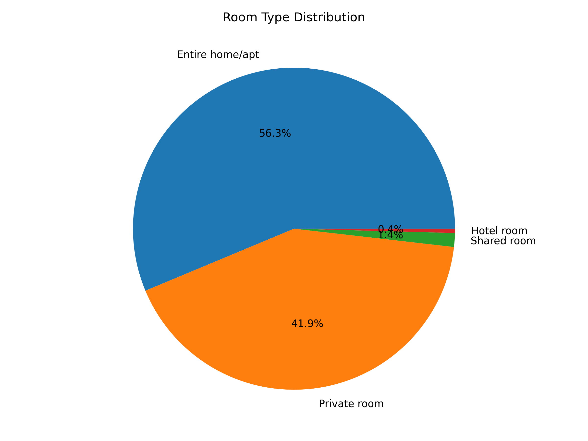
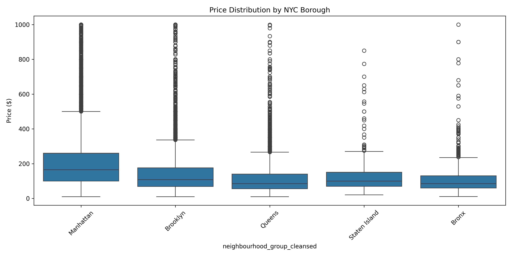
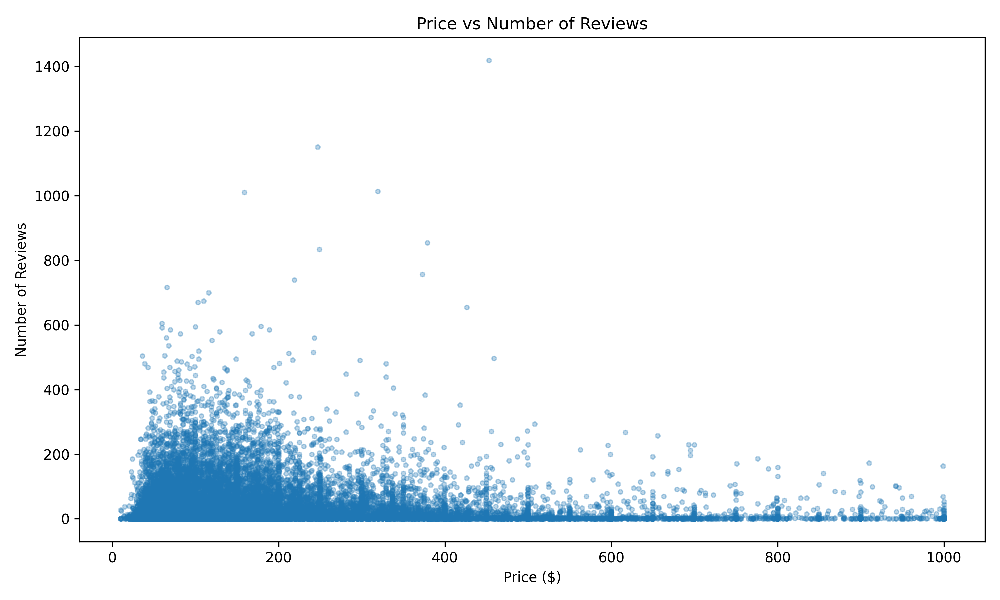

# NYC Airbnb Market Explorer - Final Report

## Executive Summary

This project analyzes the NYC Airbnb market to provide insights for real estate investors and hospitality business

## Key Findings

|         Metric             |         Value        |
|--------------- ------------|-------------- -------|
|   Total Active Listings    |       36,000+        |
|    Average Price/Night     |       $167.66        |
|    Median Price/Night      |       $125.00        |
|   Estmated Monthly Cost    |       $1945.09       |
|   Most common room type    |     Entire home/apt  |
|   Most Popular Borough     |      Manhattan       |

    ---------------------------------------------   

## Market Insights
### 1. Price Comparison
- **Airbnb monthly cost** : $1,945.09
- **Private rental** :  $3,100.00
- **Difference between average monthly cost and private** : $1154.91

### 2. Borough Analysis

### 3. Room Type Distribution
* **Entire home/apt**: 20,811 listings (56.3%)
* **Private room**: 15,489 listings (41.9%)
* **Shared room**: 513 listings (1.4%)
* **Hotel room**: 157 listings (0.4%)

### 4. Top 10 most expensive Neighbourhoods
Top 10 Most Expensive Neighborhoods:
neighbourhood
Atlantic Beach, New York, United States      595.500000
NEW YORK, New York, United States            541.866667
New York, NY, Argentina                      499.000000
Jamaica Estates, New York, United States     467.333333
Manhattan, New York, United States           454.500000
LONG ISLAND CITY, New York, United States    395.000000
Brooklyn , United States                     394.000000
Whitestone, New York, United States          364.000000
Far Rockaway , New York, United States       352.000000
Jamaica queens, New York, United States      350.000000

     --------------------------------------------
##  Methodology

### Data Sources
- **Primary** : Inside Airbnb NYC listings.csv (36,000+ records)
- **Date Range** : 2022-06-03 to 2022-12/05

### Tools Used
- Python 3.14.4
- pandas, numpy, matplotlib, seaborn
- Jupyter Notebook

### Data Cleaning Steps
1. Removed unnecessary columns (id, host_name, licennse)
2. Stripped whitespace from string columns
3. Formatted date columns (last_review)
4. Handled missing values ( filled with median)
5. Converted numeric columns to correct types
6. Removed outliers (prices > $1000 or < $0)
7. Created new feature: price_category

### Analysis performed
- Grouped statistics by borough
- Calculated price distributions
- Correlation analysis (price vs reviews)
- Availability analysis
- Room type distribution

   ---------------------

## Visualisations

### 1. Price Distributions by Borough

### 2. Room Type Distribution

### 3. Price vs Reviews Correlation

    ------------------------

## Project Files
nyc-airbnb-market-explorer/
├── data/
│ ├── raw/listings.csv
│ └── processed/cleaned_airbnb_data.csv
├── src/
│ ├── 01_data_import.ipynb
│ ├── 02_data_cleaning.ipynb
│ └── 03_data_analysis.ipynb
├── output/
│ ├── market_summary_report.md (this file)
│ ├── market_summary_report.csv
│ ├── top_neighborhoods.csv
│ ├── price_by_borough.png
│ ├── room_type_distribution.png
│ └── price_vs_reviews.png
└── README.md

    -----------------------------

## Skills Demonstrated 

✅ Data importing (CSV, multiple sources)  
✅ Data exploration (head(), describe(), info())  
✅ Data cleaning (strings, dates, missing values)  
✅ Data merging and aggregation  
✅ Feature engineering (price_category)  
✅ Statistical analysis (mean, median, std)  
✅ Data visualization (matplotlib, seaborn)  
✅ Business insights generation  

     ------------------------------------

## Lessons Learned

1. **Data quality matters**: Real-world data has missing values and outliers
2. **Date formatting is critical**: last_review needed proper datetime conversion
3. **Outlier removal**: Prices > $1000 skewed the average significantly
4. **Feature engineering**: Creating price_category made analysis more actionable

      ------------------------------------

## Future improvements

- Add calendar data for availability trends
- Incorporate geospatial analysis with neighbourhoods.geojson
- Build automated data pipeline with Airflow
- Deploy as web dashboard using Streamlit

---

**Author**: Benny Mutugi
**Date**: June 21, 2026  
**License**: MIT
